# 🤖 AI Resume Analyzer & ATS Score Checker

An AI-powered web application that analyzes resumes against job descriptions, calculates ATS compatibility scores, identifies missing skills, and provides AI-generated feedback to help users improve their resumes.

---

## ✨ Features

- 🔐 User Registration & Login
- 📄 Upload Resume (PDF)
- 📝 Resume Text Extraction
- 🤖 AI-Powered Resume Analysis
- 📊 ATS Score Calculation
- ✅ Matched Skills Detection
- ❌ Missing Skills Detection
- 📈 Dashboard with Analytics
- 📉 ATS Score Trend Chart
- 📜 Resume Analysis History
- 🔍 Search Previous Analyses
- 👁 View Full Resume Analysis
- 🗑 Delete Analysis History
- 📄 Download PDF Report

---

## 🛠️ Tech Stack

### Backend
- Python
- Flask

### Frontend
- HTML5
- CSS3
- Bootstrap 5
- JavaScript

### Database
- MySQL

### AI & Libraries
- Google Gemini AI
- PyMuPDF
- ReportLab

### Charts
- Chart.js

---

# 📸 Screenshots

## 🏠 Home Page

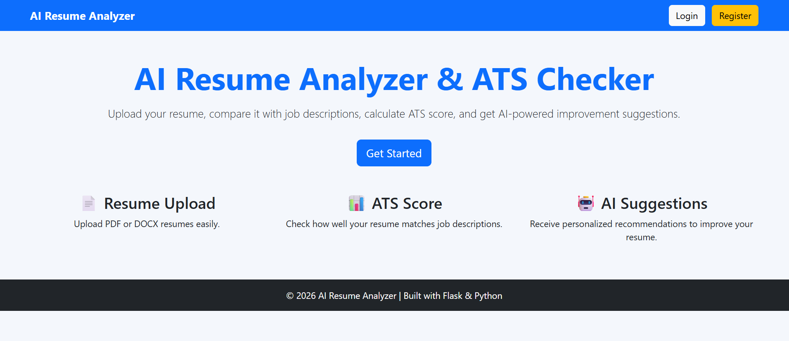

---

## 🔐 Login Page

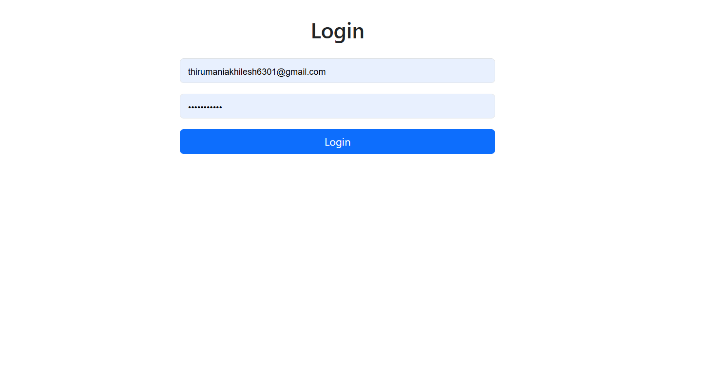

---

## 📊 Dashboard

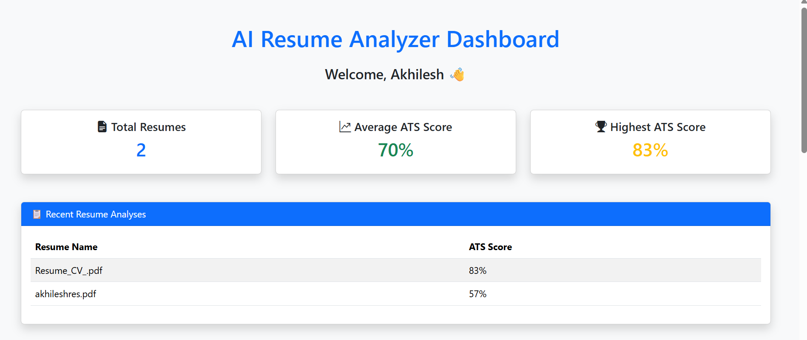

---

## 📈 ATS Score Trend

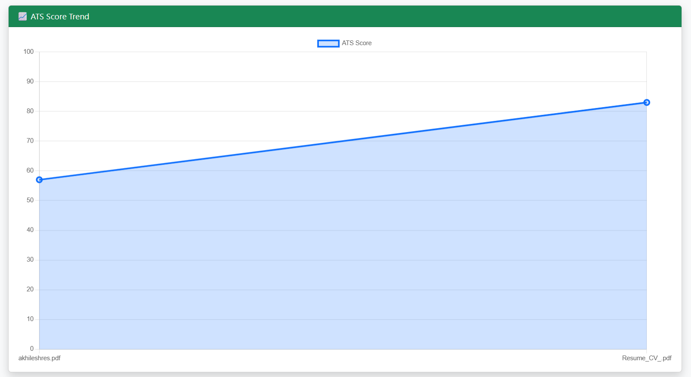

---

## ⚡ Dashboard Actions

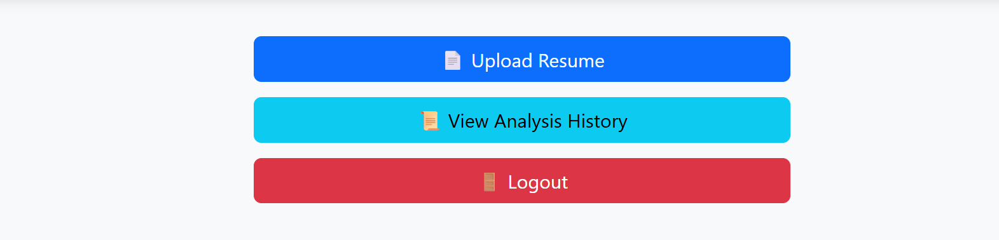

---

## 📄 Upload Resume

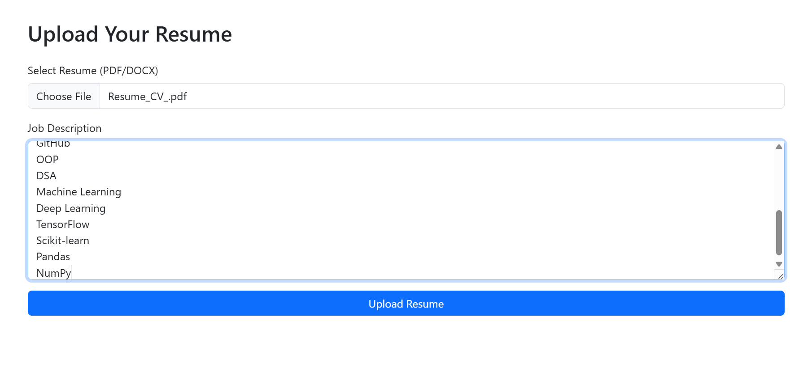

---

## 📊 ATS Score Result

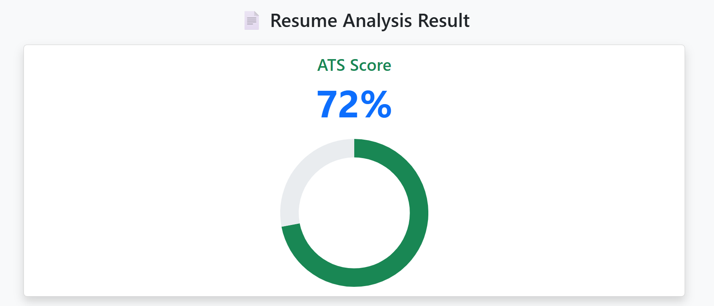

---

## 🤖 AI Feedback

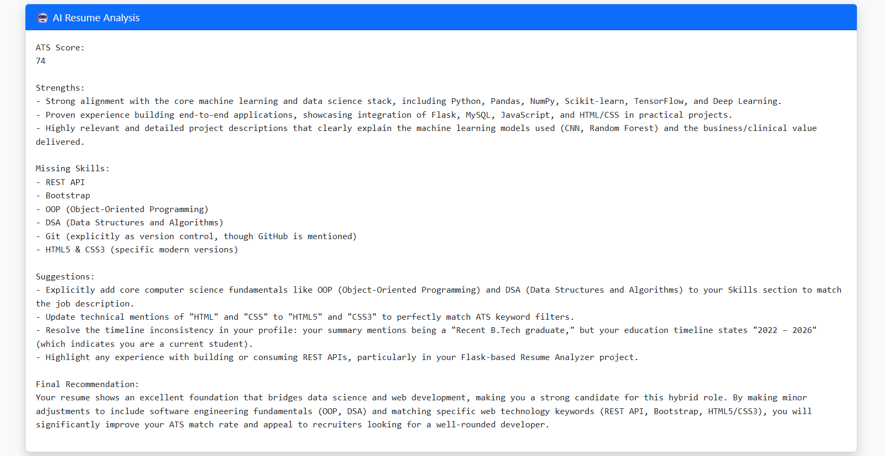

---

## ✅ Matched & Missing Skills

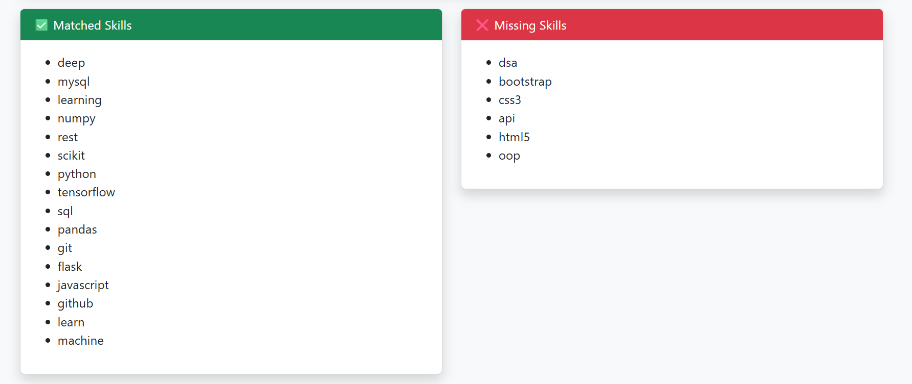

---

## 📄 Extracted Resume Text

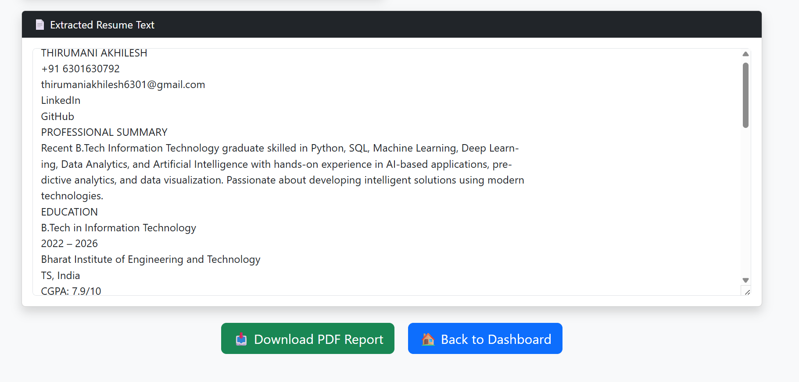

---

## 📜 Resume Analysis History

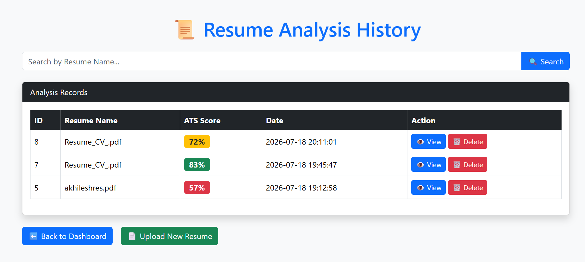

---

## 👁 View Analysis

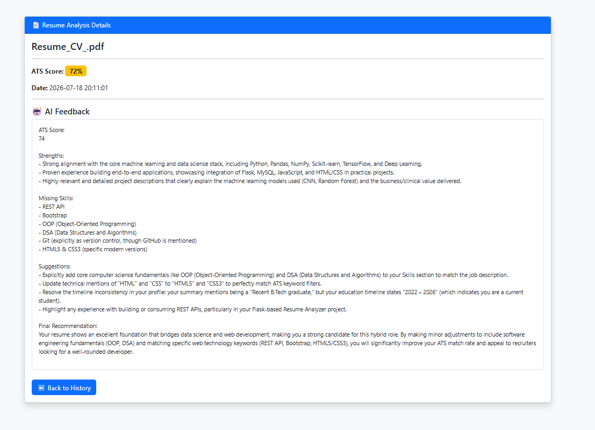

---

# 📂 Project Structure

```text
AI-Resume-Analyzer/
│
├── app.py
├── config.py
├── requirements.txt
├── README.md
├── .gitignore
│
├── models/
├── static/
├── templates/
├── uploads/
├── utils/
└── screenshots/
```

---

# 🚀 Installation

Clone the repository

```bash
git clone https://github.com/akhilesh6301/AI-Resume-Analyzer.git
```

Go to the project folder

```bash
cd AI-Resume-Analyzer
```

Create a virtual environment

```bash
python -m venv venv
```

Activate the virtual environment

### Windows

```bash
venv\Scripts\activate
```

### Linux/macOS

```bash
source venv/bin/activate
```

Install dependencies

```bash
pip install -r requirements.txt
```

Run the application

```bash
python app.py
```

Open your browser and visit:

```text
http://127.0.0.1:5000
```

---

# 🎯 Project Workflow

1. User registers and logs in.
2. Uploads a PDF resume.
3. Enters a job description.
4. Resume text is extracted.
5. ATS score is calculated.
6. AI analyzes the resume.
7. Matched and missing skills are identified.
8. Results are displayed.
9. A PDF report is generated.
10. Analysis is stored in MySQL.
11. User can view, search, or delete previous analyses.

---

# 🔮 Future Enhancements

- Resume Ranking
- Resume Comparison
- Resume Templates
- Email PDF Reports
- Admin Dashboard
- Cloud Deployment
- Multi-language Support

---

# 👨‍💻 Author

**Thirumani Akhilesh**

- GitHub: https://github.com/akhilesh6301
- LinkedIn: https://linkedin.com/in/akhilesh-thirumani-6983b041b

---

⭐ If you like this project, consider giving it a star!